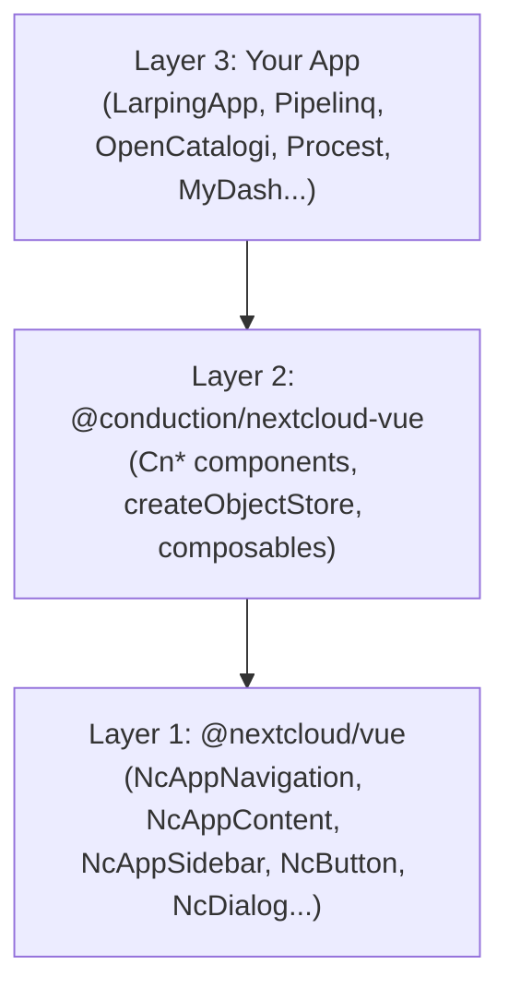

# Architecture Overview

`@conduction/nextcloud-vue` is a **Layer 2** component library that sits between Nextcloud's official Vue components and individual Nextcloud apps.

## The Three Layers



### Layer 1: Nextcloud Vue

Nextcloud's official component library provides layout primitives and UI building blocks:
- **NcAppNavigation** — sidebar navigation container
- **NcAppContent** — main content area
- **NcAppSidebar** — right-side detail panel
- **NcDialog** — modal dialogs
- **NcButton, NcTextField, NcSelect** — form controls

See the full API at [Nextcloud Vue Components](https://nextcloud-vue-components.netlify.app/) and layout patterns at [Nextcloud Layout Components](https://docs.nextcloud.com/server/stable/developer_manual/design/layoutcomponents.html).

### Layer 2: @conduction/nextcloud-vue

This library composes Layer 1 primitives into **opinionated, schema-driven page patterns**. It does NOT replace Nextcloud Vue — it adds higher-level abstractions:

- **CnIndexPage** wraps NcAppContent into a full list page with table, filters, pagination, and CRUD dialogs
- **CnIndexSidebar** wraps NcAppSidebar into a search/filter/column-visibility panel
- **CnDataTable** provides a sortable, selectable data table with schema-driven columns
- **CnFormDialog** wraps NcDialog into a schema-driven create/edit form
- **createObjectStore** provides a Pinia store factory with OpenRegister CRUD, file management, audit trails, and relations

### Layer 3: Your App

Individual apps use both layers. They import Cn* components for page structure and can still use Nc* components directly for custom UI elements:

```vue
<template>
  <!-- Cn* for page structure (Layer 2) -->
  <CnIndexPage :schema="schema" :objects="objects" />

  <!-- Nc* for custom elements (Layer 1) -->
  <NcButton @click="doCustomThing">Custom Action</NcButton>
</template>
```

## Component Mapping

Every Cn* component is built on one or more Nc* primitives:

| @conduction/nextcloud-vue | Wraps | Purpose |
|---------------------------|-------|---------|
| **CnIndexPage** | NcEmptyContent, NcLoadingIcon | Schema-driven list page with table, filters, pagination, and CRUD dialogs |
| **CnIndexSidebar** | NcAppSidebar, NcAppSidebarTab | Tabbed sidebar with search, filter, and column visibility controls |
| **CnFacetSidebar** | NcButton, NcSelect, NcTextField | Faceted search sidebar auto-generated from schema |
| **CnDataTable** | NcLoadingIcon, NcCheckboxRadioSwitch | Sortable data table with selection and schema-driven columns |
| **CnDeleteDialog** | NcDialog, NcButton, NcNoteCard | Two-phase delete confirmation |
| **CnCopyDialog** | NcDialog, NcButton, NcSelect | Two-phase copy with naming pattern |
| **CnFormDialog** | NcDialog, NcTextField, NcSelect, NcCheckboxRadioSwitch | Schema-driven create/edit form |
| **CnFilterBar** | NcTextField, NcSelect, NcButton | Search and filter controls row |
| **CnPagination** | NcButton, NcSelect | Full pagination with page numbers and size selector |
| **CnRowActions** | NcActions, NcActionButton | Action menu for table rows |
| **CnMassActionBar** | NcActions, NcActionButton | Mass action dropdown |
| **CnSettingsSection** | NcSettingsSection, NcLoadingIcon, NcButton | Admin settings section with loading/error states |
| **CnRegisterMapping** | NcSelect, NcNoteCard | OpenRegister schema configuration panel |

Apps still import NcAppNavigation directly for their main menu — this is intentionally NOT wrapped because navigation is app-specific.

## Design Philosophy

1. **Schema-driven**: Define your data schema once in OpenRegister. The library reads it to auto-generate table columns, filter options, form fields, and facets.

2. **Two-phase dialogs**: All destructive actions (delete, copy) and creation follow a confirm → result pattern. The app triggers the action, the dialog shows a spinner, and the app calls `setResult()` when the API responds.

3. **Composable over configurable**: Rather than one mega-component, the library provides focused components (CnDataTable, CnFilterBar, CnPagination) that can be composed into custom layouts. CnIndexPage is a pre-composed "batteries included" option.

4. **NL Design compatible**: All components use Nextcloud CSS variables (not hardcoded colors), ensuring automatic compatibility with the [NL Design System](../integrations/nldesign.md) theming layer.
