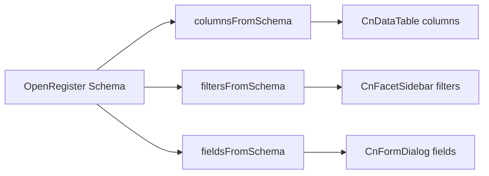

# Schema-Driven Pattern

The core idea: **define your data schema once, get a working UI automatically**.

## How It Works



### 1. Schema Definition

An OpenRegister schema defines entity properties with types, constraints, and display hints:

```json
{
  "title": "Contact",
  "properties": {
    "name": { "type": "string", "required": true },
    "email": { "type": "string", "format": "email" },
    "status": { "type": "string", "enum": ["active", "inactive", "lead"] },
    "company": { "type": "string" },
    "created": { "type": "string", "format": "date-time" }
  }
}
```

### 2. Auto-Generated Columns

`columnsFromSchema()` reads properties and creates table column definitions:

```js
import { columnsFromSchema } from '@conduction/nextcloud-vue'

const columns = columnsFromSchema(schema)
// Result:
// [
//   { key: 'name', label: 'Name', sortable: true },
//   { key: 'email', label: 'Email', sortable: true },
//   { key: 'status', label: 'Status', sortable: true },
//   { key: 'company', label: 'Company', sortable: true },
//   { key: 'created', label: 'Created', sortable: true },
// ]
```

`CnDataTable` uses these columns, and `CnCellRenderer` renders each cell based on the property type — booleans get checkmarks, enums get status badges, dates get formatted, UUIDs get monospace styling.

### 3. Auto-Generated Filters

`filtersFromSchema()` identifies filterable properties (enums, booleans, facetable fields):

```js
import { filtersFromSchema } from '@conduction/nextcloud-vue'

const filters = filtersFromSchema(schema)
// Result: filter definitions for 'status' enum, etc.
```

`CnFacetSidebar` renders these as interactive filter controls with live counts from the OpenRegister API.

### 4. Auto-Generated Form Fields

`fieldsFromSchema()` creates form field definitions for create/edit dialogs:

```js
import { fieldsFromSchema } from '@conduction/nextcloud-vue'

const fields = fieldsFromSchema(schema)
// Result: field definitions with widget types (text, email, select, date...)
```

`CnFormDialog` renders these as a complete form with validation.

### 5. All Together in CnIndexPage

`CnIndexPage` combines all of this into a single component:

```vue
<CnIndexPage
  :schema="schema"
  :objects="objects"
  :pagination="pagination" />
```

No manual column definitions, no filter setup, no form configuration. The schema drives everything.

## Customization

While the defaults work well, every auto-generated aspect can be overridden:

### Column Overrides

```vue
<CnDataTable
  :schema="schema"
  :excludeColumns="['created', 'updated']"
  :includeColumns="['name', 'email', 'status']"
  :columnOverrides="{
    name: { label: 'Full Name', width: '200px' },
    status: { label: 'Current Status' },
  }" />
```

### Field Overrides

```vue
<CnFormDialog
  :schema="schema"
  :excludeFields="['id', 'created']"
  :fieldOverrides="{
    status: { widget: 'select', options: customStatusOptions },
  }" />
```

### Custom Cell Renderers

```vue
<CnDataTable :schema="schema">
  <template #column-status="{ row, value }">
    <CnStatusBadge :label="value" :colorMap="{ active: 'success', inactive: 'error' }" />
  </template>
</CnDataTable>
```
