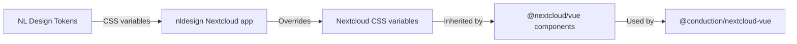

# NL Design System

The [NL Design System](https://nldesignsystem.nl/) provides Dutch government design standards implemented as CSS design tokens. The `nldesign` Nextcloud app applies these tokens, and `@conduction/nextcloud-vue` is fully compatible.

## How It Works



1. **NL Design tokens** define colors, spacing, typography per organization (Rijkshuisstijl, Utrecht, Amsterdam, etc.)
2. **nldesign app** loads these tokens as CSS custom properties that override Nextcloud's defaults
3. **Nextcloud Vue** components use CSS variables (`--color-primary`, `--color-background`, etc.)
4. **@conduction/nextcloud-vue** inherits these because it wraps Nextcloud Vue components

No code changes are needed in your app — when the nldesign app is enabled, all Cn* components automatically adopt the active theme.

## Available Token Sets

| Token Set | Organization |
|-----------|-------------|
| Rijkshuisstijl | Dutch national government |
| Utrecht | Municipality of Utrecht |
| Amsterdam | Municipality of Amsterdam |
| Den Haag | Municipality of The Hague |
| Rotterdam | Municipality of Rotterdam |

## Compatibility Requirements

To ensure your app works with NL Design theming:

### Do

- Use standard Nextcloud Vue components (`NcButton`, `NcTextField`, etc.)
- Use CSS variables for colors: `var(--color-primary)`, `var(--color-background-dark)`
- Use Nextcloud's spacing variables where available
- Test with the nldesign app enabled (switch between token sets)
- Ensure WCAG AA contrast ratios

### Don't

- Hardcode colors (e.g., `color: #0082C9`)
- Hardcode font families
- Use `!important` on color properties
- Override Nextcloud CSS variable names in your styles

### Example: Custom Styling

```css
/* Good — uses CSS variables */
.my-card {
  background: var(--color-background-dark);
  border: 1px solid var(--color-border);
  color: var(--color-main-text);
}

/* Bad — hardcoded colors */
.my-card {
  background: #f5f5f5;
  border: 1px solid #ccc;
  color: #333;
}
```

## Testing with NL Design

1. Enable the `nldesign` app in your Nextcloud instance
2. Go to Admin Settings → NL Design
3. Select a token set (e.g., Rijkshuisstijl)
4. Navigate to your app and verify:
   - Colors change to match the selected theme
   - Text remains readable (contrast)
   - No hardcoded colors bleed through
   - Dark mode still works (if the token set supports it)

## Accessibility

NL Design compliance includes WCAG AA accessibility requirements:

- Minimum 4.5:1 contrast ratio for normal text
- Minimum 3:1 contrast ratio for large text
- Focus indicators visible
- Interactive elements keyboard-accessible
- All Cn* components inherit Nextcloud's ARIA attributes
