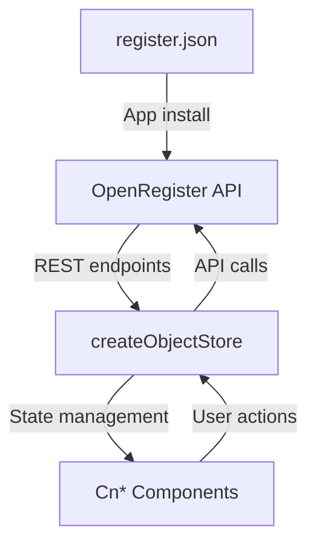

# OpenRegister Integration

`@conduction/nextcloud-vue` is designed to work with [OpenRegister](https://github.com/ConductionNL/openregister) — a schema-driven object store for Nextcloud.

## What is OpenRegister?

OpenRegister is a Nextcloud app that provides:
- **Schema-driven data storage** — define entities via JSON Schema, get a REST API automatically
- **Registers** — logical groupings of schemas (like databases)
- **Sources** — external API connections for data sync
- **Faceted search** — schema properties marked `facetable` return aggregated counts
- **Relations** — `$ref` properties link entities together
- **RBAC & Multitenancy** — organisation-based access control

## Data Flow



### 1. Register JSON

Each app ships a `\{appname\}_register.json` that defines its data model:

```json
{
  "register": {
    "name": "MyApp",
    "description": "My application register"
  },
  "schemas": [
    {
      "title": "Contact",
      "icon": "AccountGroupOutline",
      "properties": {
        "name": { "type": "string", "required": true },
        "email": { "type": "string", "format": "email" },
        "status": { "type": "string", "enum": ["active", "inactive"] }
      }
    }
  ],
  "sources": [
    {
      "name": "MyApp Source",
      "type": "internal"
    }
  ]
}
```

On app install, OpenRegister imports this file and creates the register, schemas, and sources.

### 2. REST API

OpenRegister exposes REST endpoints per register/schema:

| Method | Endpoint | Description |
|--------|----------|-------------|
| GET | `/apps/openregister/api/objects/\{register\}/\{schema\}` | List objects (paginated) |
| GET | `/apps/openregister/api/objects/\{register\}/\{schema\}/\{id\}` | Get single object |
| POST | `/apps/openregister/api/objects/\{register\}/\{schema\}` | Create object |
| PUT | `/apps/openregister/api/objects/\{register\}/\{schema\}/\{id\}` | Update object |
| DELETE | `/apps/openregister/api/objects/\{register\}/\{schema\}/\{id\}` | Delete object |

Query parameters: `_page`, `_limit`, `_sort`, `_order`, `_search`, `_fields`, plus filter params matching schema property names.

### 3. Object Store

`createObjectStore` wraps these API calls into a Pinia store:

```js
store.registerObjectType('contact', 'schema-id', 'register-id')

// These calls hit the OpenRegister API:
await store.fetchCollection('contact', { _page: 1, _limit: 20 })
await store.saveObject('contact', { name: 'Alice', email: 'alice@example.com' })
```

### 4. Components

Cn* components read data from the store and display it based on the schema:

```vue
<CnIndexPage
  :schema="store.getSchema('contact')"
  :objects="store.getCollection('contact')"
  :pagination="store.getPagination('contact')"
  @create="data => store.saveObject('contact', data)" />
```

## Faceting

Schema properties can be marked `facetable` to enable faceted search:

```json
{
  "status": {
    "type": "string",
    "enum": ["active", "inactive", "lead"],
    "facetable": true
  }
}
```

The API returns facet counts alongside search results. CnFacetSidebar renders these as interactive filters with live counts.

### Aggregated vs Scoped Facets

- `facetable.aggregated: true` — facet is merged across schemas in multi-schema searches
- `facetable.aggregated: false` — facet is scoped to its own schema

## Relations

Schema properties with `$ref` define relations between entities:

```json
{
  "company": {
    "$ref": "schema-uuid-of-company",
    "type": "string",
    "format": "uuid"
  }
}
```

The `relationsPlugin` adds methods to fetch, add, and remove these relations. CnIndexSidebar can display related objects in tabs.

## Settings Pattern

Apps typically store OpenRegister UUIDs in Nextcloud's IAppConfig and expose them via a settings endpoint:

```
GET /apps/myapp/api/settings
→ { objectTypes: { contact: { source, register, schema }, company: { ... } } }
```

The `initializeStores()` pattern reads these settings at boot and registers all object types.
